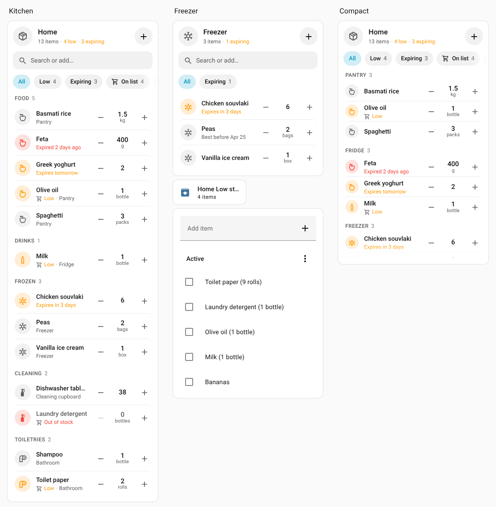
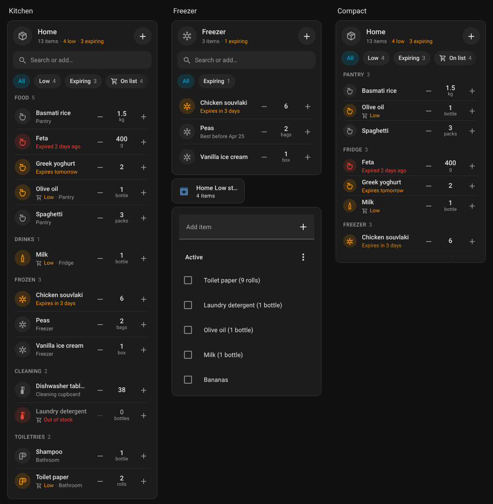
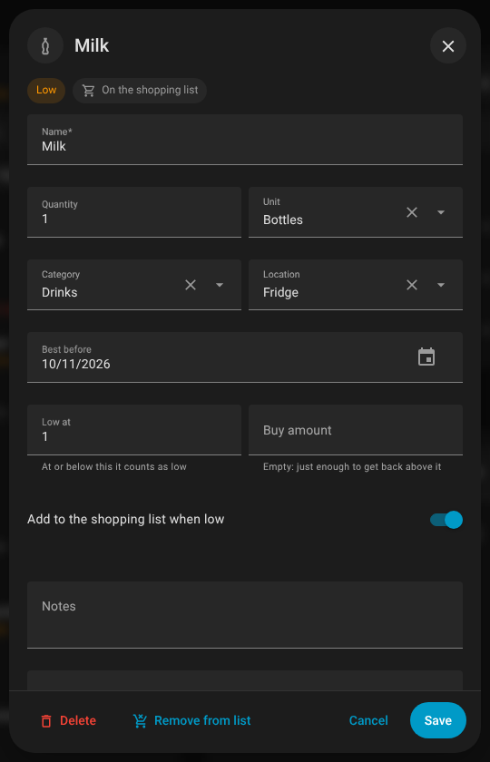
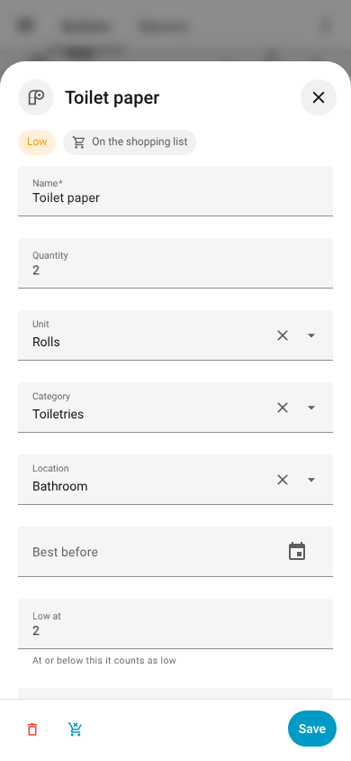
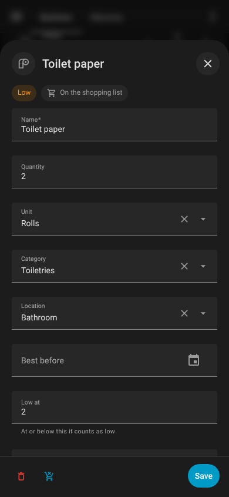
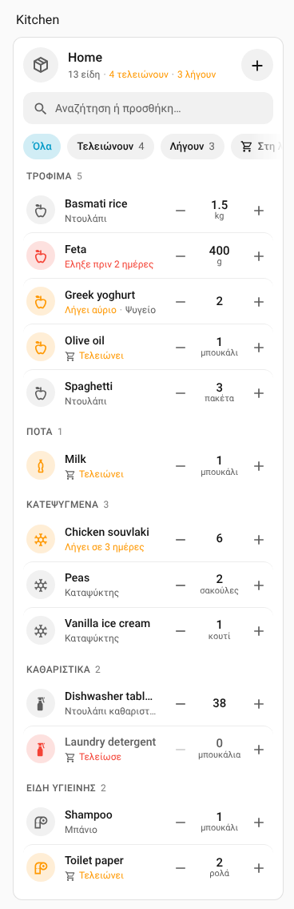

# Stock Pulse

A household inventory for Home Assistant, with a shopping list that fills itself and a sleek dashboard card to run it.

- Keep count of what you have at home: quantity and unit (pieces, packs, rolls, bottles, kg…), category, location (pantry, fridge, **freezer**…), best-before date, notes.
- Give an item a **threshold** and it goes on your shopping list by itself when stock drops to it.
- **Tick it off the shopping list** when you buy it and the bought amount is added back to the inventory.
- A card that looks at home next to the built-in cards: search and quick add, filter chips, grouping, +/- steppers, and an edit sheet. English and Greek.

Screenshots are from Home Assistant 2026.2 (sections view, built-in light and dark themes).





| Edit sheet, dark | Phone, light | Phone, dark | Greek |
| --- | --- | --- | --- |
|  |  |  |  |

**Themes:** the card takes every colour from your Home Assistant theme, so it follows light, dark and auto mode and any custom theme without settings. Colour is used only for items that need attention. With the [Pulse theme](https://github.com/zacharatos/pulse-theme), it reads the theme's shared `--pulse-*` tokens and sits with the other Pulse cards as one family.

## Why an integration and not just a card

A card only runs while a dashboard is open. The shopping-list loop has to work when you tick an item off on your phone in the supermarket, from the companion app, a voice assistant or another to-do app. So Stock Pulse is a small integration that stores the inventory and watches the shopping list, and it serves the card itself. One HACS install gives you both; there is no dashboard resource to add.

## Install

1. HACS → ⋮ → **Custom repositories** → add `https://github.com/zacharatos/stock-pulse-integration`, type **Integration**.
2. Install **Stock Pulse** and restart Home Assistant.
3. **Settings → Devices & services → Add integration → Stock Pulse.** Name the inventory and pick a shopping list (any to-do entity; the built-in `todo.shopping_list` is suggested).
4. Add the card: edit a dashboard → **Add card** → **Stock Pulse Card**.

Minimum Home Assistant version: 2025.7.

## The shopping-list loop

```
 quantity drops to the threshold ──▶  "Toilet paper (9 rolls)" is added to the shopping list
                                                 │
                    ticked off in any app ◀──────┘
                                 │
                                 ▼
               +9 rolls added back to the inventory
```

- **Threshold ("Low at")**: an item is low when its quantity is at or below it. Items without a threshold are never added automatically.
- **Buy amount**: how much to buy each time (a 9-pack of toilet paper). Leave it empty and Stock Pulse buys just enough to get back above the threshold. The entry's text follows the stock while it is on the list.
- **You change the amount in the list** (`Milk (4 bottles)`)? That is what gets restocked.
- **You buy it without the list** (you raise the quantity yourself)? The open entry is removed.
- **You delete the entry from the list** without buying? It is not added again until the item has been above its threshold once.
- **Entries typed by hand** (`Milk`, `dish soap (2)`) restock an item with the same name when ticked off. Turn this off in the options if you don't want it.
- **Run out and restock** clears the old best-before date, since that batch is gone.
- Entries that were already ticked off when you set the integration up are treated as history, not purchases.

Every rule can be switched in **Settings → Devices & services → Stock Pulse → Configure**: shopping list, add low items, restock when bought, match hand-typed entries, remove bought entries from the list, and how many days count as "expiring soon".

Works with any to-do integration that supports adding, updating and removing items (Shopping list, Local to-do, and most cloud lists).

## The card

```yaml
type: custom:stock-pulse-card
```

That is a complete config. Everything below is optional and available in the visual editor.

| Option | Default | What it does |
| --- | --- | --- |
| `inventory` | the only one | Config entry id or name of the inventory, when you have more than one. |
| `title` | inventory name | Card title. |
| `icon` | `mdi:package-variant-closed` | Card icon. |
| `group_by` | `category` | `category`, `location` or `none`. |
| `sort` | `name` | `name`, `quantity` (lowest first) or `expiry` (soonest first). |
| `locations` | all | Only show these locations, e.g. `[freezer]` for a freezer card. New items get that location. |
| `categories` | all | Only show these categories. |
| `show_search` | `true` | The search box, which doubles as quick add: type a name and press Enter. |
| `show_filters` | `true` | Chips for All, Low, Expiring, On list and each location. |
| `hide_out_of_stock` | `false` | Hide items at 0 (the Low chip and search still find them). |
| `compact` | `false` | Shorter rows; only urgent details are shown under a name. |
| `max_height` | none | e.g. `480px`; the list scrolls inside the card. |

A freezer card:

```yaml
type: custom:stock-pulse-card
title: Freezer
icon: mdi:snowflake
locations: [freezer]
group_by: none
sort: expiry
```

Built-in units, categories and locations are translated; you can also type your own (a "Garage" location, a "Ferments" category, a "carton" unit).

## Sensors

Each inventory gets four sensors, each with an `items` attribute listing the matching items:

| Sensor | Counts |
| --- | --- |
| `sensor.<name>_in_stock` | items with quantity above 0 |
| `sensor.<name>_low_stock` | items at or below their threshold, or at 0 |
| `sensor.<name>_expiring_soon` | items whose date is within the "expiring soon" days |
| `sensor.<name>_expired` | items past their date |

## Actions

All take an optional `inventory` (needed only if you have several). `item` is a name (case-insensitive) or an id.

| Action | Use |
| --- | --- |
| `stock_pulse.add_item` | Add an item; if one with that name exists, its quantity is increased. |
| `stock_pulse.update_item` | Change any field. |
| `stock_pulse.adjust_quantity` | `amount: -1` when you open one, `+6` when you unpack. Great on an NFC tag. |
| `stock_pulse.remove_item` | Delete an item. |
| `stock_pulse.add_to_shopping_list` | Put an item on the list now. |
| `stock_pulse.sync_shopping_list` | Read the list now (it is also read on every change and every 10 minutes). |
| `stock_pulse.get_items` | Returns items (`only: low / out / on_shopping_list`, `location`, `category`) for scripts and voice assistants. |

## Events

`stock_pulse_low_stock`, `stock_pulse_added_to_shopping_list` and `stock_pulse_restocked`, with the item's name, quantity, unit, location and category.

### Example: a morning heads-up about expiring food

```yaml
triggers:
  - trigger: time
    at: "08:00:00"
conditions:
  - condition: numeric_state
    entity_id: sensor.home_expiring_soon
    above: 0
actions:
  - action: notify.mobile_app_phone
    data:
      title: Use these soon
      message: >
        {{ state_attr('sensor.home_expiring_soon', 'items') | map(attribute='name') | join(', ') }}
```

### Example: an NFC tag on the coffee cupboard

```yaml
triggers:
  - trigger: tag
    tag_id: coffee
actions:
  - action: stock_pulse.adjust_quantity
    data:
      item: Coffee
      amount: -1
```

## Development

```bash
npm install
npm run typecheck && npm test && npm run build   # card → custom_components/stock_pulse/frontend/
bash scripts/install-test-deps.sh && pytest     # integration
python3 -m http.server 8765                      # then open /test/harness.html (?dark=1, ?lang=el, ?missing=1)
```

The built card is committed on purpose: HACS installs `custom_components/stock_pulse` straight from the tag. See [AGENTS.md](AGENTS.md) for the project's working rules.
